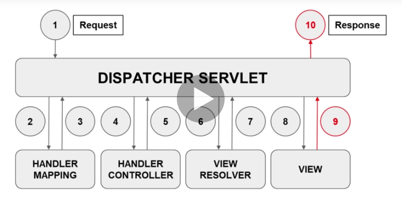

# Spring MVC

Based on the MVC design pattern:

- Model (M): models are responsible for the managing the application's data, business logic and business rules
- View (V): is an output representation of information, for example displaying information or reports to the user either as web form or as charts
- Controller (C): is responsible for invoking Models to perform business logic and then updating the view based on the Models output.

With Spring MVC we can use different view technologies to render web pages.
For example Groovy Markup, Freemarker and Thymeleaf. Spring MVC also integrates with other web frameworks.

Servlets: are JAVA-classes, who's instances inside a web-server handle client requests and answers them

## Maven WAR and Maven Cargo

- WAR: web application archive
  - contain the resources for developing web applications
- Maven WAR plugin: is responsible for collectiong all artifact dependencies, classes and resources of the web
  application and packaging them into a web application archive
  
- add war packaging to the pom-xml file:
  - create a new directory `webapp in src/main`: `webapp` and therein a new directory `WEB-INF`
  - `WEB-INF`: special directory that contains all things related to the application that are not in the root of the applications
    --> files cannot be served directly to the client by the container
    but the contents of `WEB-INF` are visible to the servlet code
    this folder will contain *.jsp files
  - add `src/main/webapp/index.html` with basic HTML hello world content to test the war plugin

```xml
<project>
    <packaging>war</packaging>
</project>
```

- add the maven-war plugin to `pom.xml`:
```xml
  <plugin>
  <groupId>org.apache.maven.plugins</groupId>
  <artifactId>maven-war-plugin</artifactId>
  <version>3.2.0</version>
  </plugin>
```
- maven-cargo-plugin: we can manipulate use goals to manipulate war projects within the Apache Tomcat severlet container.
  We can run tomcat in embedded mode.
- add cargo-maven2-plugin to plugins in `pom.xml`
- within the `configuration`: a tomcat9x container is specified, and it is set to embedded so that out application is 
deployed within the embedded cargo tomcat webserver. So there is no need to install a tomcat server on our own.
- to run the cargo plugin, go to maven goals, open the plugins section -> cargo -> cargo:run   
- browse to http://localhost:8080/todo-list/
```xml
<plugin>
    <groupId>org.codehaus.cargo</groupId>
    <artifactId>cargo-maven2-plugin</artifactId>
    <version>1.6.7</version>
    <configuration>
        <container>
            <containerId>tomcat9x</containerId>
            <type>embedded</type>
        </container>
    </configuration>
</plugin>
```

## Setup Spring MVC Dispatcher Servlet

- setup using Java configuration instead of an XML files
- The Dispatcher Servlet is the front controller of Spring MVC and is used to dispatch HTTP requests to other controls
- Two ways to register a servlet in our application:
  - web.xml
  - register programmatically by Java code
- create a new package in `src/main/java`: `academy.learnprogramming.config`
- new class `WebConfig`
- add annotations, so that it becomes a configuration spring class. We also add the @EnableWebMvc annotation of spring
```java
@EnableWebMvc
@Configuration
@ComponentScan(basePackages = "academy.learnprogramming")
public class WebConfig {
}
```

- add servlet api to `pom.xml` file. The scope `provided` is there, so that the servlet container will provide 
this dependency for us. We do not need to package that in our war file.
```xml
<dependency>
    <groupId>javax.servlet</groupId>
    <artifactId>javax.servlet-api</artifactId>
    <version>${servlet-api.version}</version>
    <scope>provided</scope>
</dependency>
```

- Servlet registration: we have to implment the WebApplicationInitializer interface
- The interface will automatically be detected by Spring on startup

```java
public class WellAppIntializer implements WebApplicationInitializer {
    @Override
    public void onStartup(ServletContext servletContext) throws ServletException {
        
    }
}
```

- then:
    - create a new spring context and register our config class
    - create a dispatcher servlet and provide the context object
    - register and configure the dispatcher servlet

```java
public class WellAppIntializer implements WebApplicationInitializer {

    private static final String DISPATCHER_SERVLET_NAME = "dispatcher";
    private ServletRegistration.Dynamic registration;

    @Override
    public void onStartup(ServletContext servletContext) throws ServletException {

        log.info("onStartup");
        // create the spring application context
        AnnotationConfigWebApplicationContext context = new AnnotationConfigWebApplicationContext();
        context.register(WebConfig.class);

        // create the dispatcher servlet
        DispatcherServlet dispatcherServlet = new DispatcherServlet(context);

        // register and configure the dispatcher servlet
        ServletRegistration.Dynamic registration = servletContext.addServlet(DISPATCHER_SERVLET_NAME, dispatcherServlet);
        registration.setLoadOnStartup(1);
        registration.addMapping("/"); // overrides the default hompage servlet of tomcat and shows our own
    }
}
```

## Controller

The Spring MVC is designed aound the Dispatcher Servlet which pays the role of Front Controller. It receives all of the
requests for your application.
 
We can map requests to methods in classes annotated with @Contrller. Those classes are known as annotated controllers or
 controller classes. Spring MVC provides an annotation-based programming model where @Controller and @RestController use
 annotations to express request mapping, request input, exception handling and more. Annotated controllers have flexible
 method signatures and do not have to extend base classes or implement specific interfaces.  

The @RequestMapping annotation is used to map requests to controller methods. It has various attributes to match by URL,
HTTP method, request parameters, header, and media types.
Shortcut variants of @RequestMapping are:
- @GetMapping (for mapping HTTP GET requests)
- @PostMapping (for mapping HTTP POST requests)
- @PutMapping (for mapping HTTP PUT requests)
- @DeleteMapping (for mapping HTTP DELETE requests)
- @PatchMapping (for mapping HTTP PATCH requests)

Create a controller class: `academy.learnprogramming.controller.DemoController`

```java
@Controller
public class DemoController {

    // http://localhost:8080/todo-list/hello
    @ResponseBody()
    @GetMapping("/hello")
    public String hello() {
        return "hello";
    }
}
```

The `@Controller` annotation is a specialisation of the `@Component` annotation and indicates that the annotated class 
is a web controller. In order to return content back to the user directly from the controller withut a view, we need to
add the `@ResponseBody` annotation to the method. Otherwise we would get an error, since the view is expected.

## View Resolver and View

The Spring MVC defines ViewResolver and View interfaces which enable us to render models in a browser without forcing us
to use specific view technology.
ViewResolver provides mapping between view names and actual views. For example, we can use JSP(Java Server Pages), 
Thymeleaf, Freemarker and so on. JSP is a text document that contains two types of text: static data, which can be 
expressed in any text-based format (such as HTML), and JSP elements, which construct dynamic content.
We use the JavaServer Pages Standard Tag Library (JSTL). JSTL is a component of the Java EE Web application development 
platform.

- Create a `view` folder in the `WEB-INF` directory, since all files in that directory are not directly accessible via 
the browser. Add a `welcome.jsp` file. Add some basic html content to the jsp file (only static content for now).

Then we have to create the view resolver bean in the `WebConfig` class:
Every view has a name, in our case `welcome` view. When the DispatcherServlet get the request for that JSP page, the prefix and
suffix will be the added to the files.

```java
public class WebConfig {

    // == constants ==
    public static final String RESOLVER_PREFIX = "/WEB-INF/view/";
    public static final String RESOLVER_SUFFIX = ".jsp";

    // == bean methods ==
    @Bean
    public ViewResolver viewResolver() {
        UrlBasedViewResolver viewResolver = new InternalResourceViewResolver();
        viewResolver.setPrefix(RESOLVER_PREFIX);
        viewResolver.setSuffix(RESOLVER_SUFFIX);
        return viewResolver;
    }
}
```
In the `DemoController.java` class, we add a new method, that returns the view name as a string. Note, that we do 
not need the foward slash for the `@GetMapping` annotation, this is added automatically.

```java
// http://localhost:8080/todo-list/welcome
// prefix + name + suffix
// /WEB-INF/view/welcome.jsp
@GetMapping("welcome")
public String welcome() {
    return "welcome"; // represents the logical view name
}
```
## Spring MVC Request Processing



1. The browser creates a request to a specific url. The Dispatcher Servlet receives the request from the server.
2. The Dispatcher Servlet needs to identify which controller will handle the request. It uses handler mapping to find 
the correct controller. 
3. Handler mapping returns the specific handler method that handles the request.
4. The Dispatcher Servlet calls the specific handler method of a controller.
5. The handler method returns the model and the view name.
6. The Dispatcher servlet has the view name as string
7. The View Resolver uses the view name to identify the correct view.
8.  The DS executes the view.
9. The view is rendered and is returned to the Dispatcher Servlet.
10. The view is returned to the browser.

## Model and Model Attributes

- Model: Model Interface defines a holder for model attribute. That model is exposed to the view so that the view can 
access those model attributes.


Add a model to the controller `DemoController`:
- add an attribute "user" to the model
- that model is automatically exposed to the view
```java
// http://localhost:8080/todo-list/welcome
@GetMapping("welcome")
public String welcome(Model model) {
    model.addAttribute("user", "David");
    log.info("model = {}", model);
    // prefix + name + suffix
    // /WEB-INF/view/welcome.jsp
    return "welcome"; // represents the logical view name
}
```

- the view can access the attribute with curly brackets:
```jsp
<html>
<head>
    <title>Welcome</title>
</head>
<body>
    <h1>Hello ${user}</h1>
</body>
</html>
```

Another way to add attributes to a model is by using annotations:
We use the `@ModelAttribute` annotation to add attributes to our model.
This creates a new attribue `welcomeMessage` that can be used by any view.
```java
@ModelAttribute("welcomeMessage")
public String welcomeMessage() {
    log.info("welcomeMessage() called");
    return "Welcome to this Demo application";
}
```
test.jsp:
```jsp
<html>
    <body>
        TEST
        <div>${welcomeMessage}</div>
    </body>
</html>
```
## A simple service

- Service: it is a stereotype for the service layer. The @Service annotation will be scanned by spring. The service
layer typically hold the business logic of the application. Controllers will use those servers.
- create a demo service (interface + implementation) in a new package `service`:

```java
public interface DemoService {
    String getHelloMessage(String user);

    String getWelcomeMessage();
}
```

- Implement that interface and add the @Service annotation
```java
@Service
public class DemoServiceImpl implements DemoService {

    @Override
    public String getHelloMessage(String user) {
        return "Hello " + user;
    }

    @Override
    public String getWelcomeMessage() {
        return "Welcome to this Demo application";
    }
}
```

- Now use the service by Constructer based DI in the controller by using `@Autowired`:
```java
@Controller
public class DemoController {

    private final DemoService demoService;
    
    @Autowired
    DemoController(DemoService demoService) {
        this.demoService = demoService;
    }

    // http://localhost:8080/todo-list/welcome
    @GetMapping("welcome")
    public String welcome(Model model) {
        model.addAttribute("hello", demoService.getHelloMessage("David"));
        log.info("model = {}", model);
        // prefix + name + suffix
        // /WEB-INF/view/welcome.jsp
        return "welcome"; // represents the logical view name
    }

    @ModelAttribute("welcomeMessage")
    public String welcomeMessage() {
        log.info("welcomeMessage() called");
        return demoService.getWelcomeMessage();
    }
}
``` 